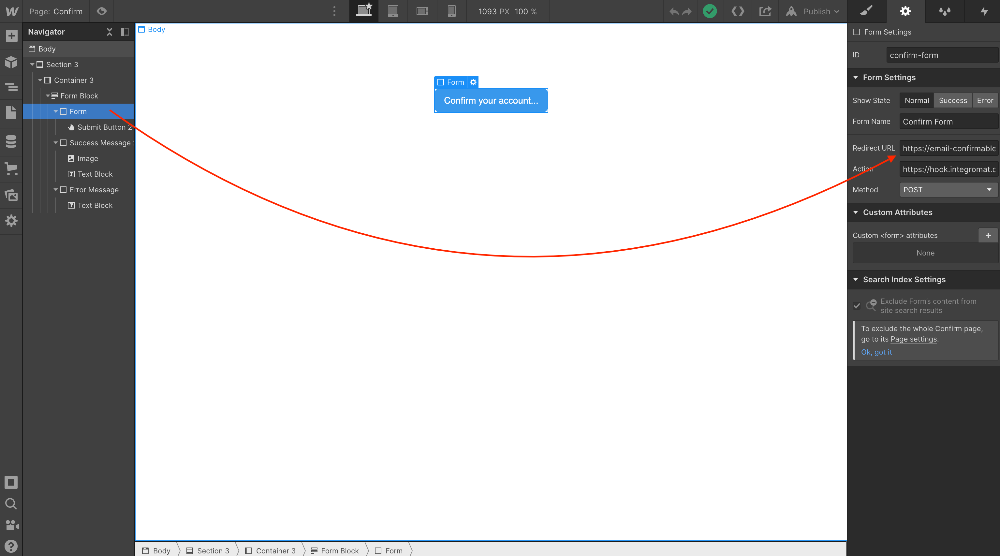
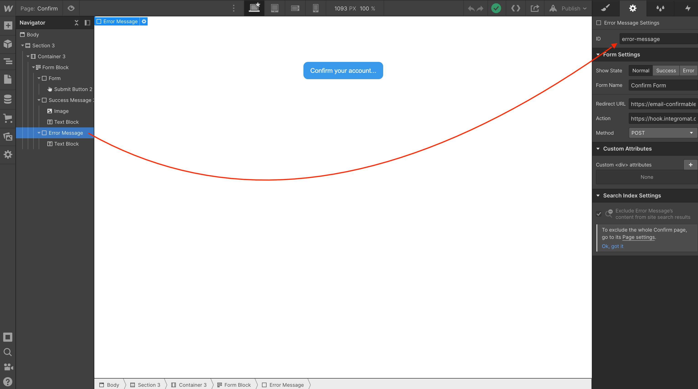
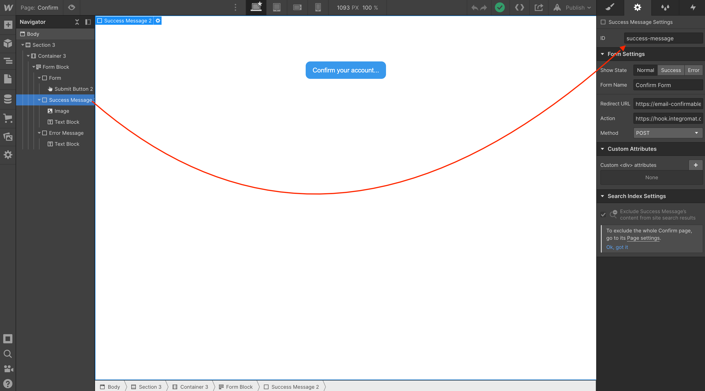

## Confirm page: Binding Webflow page elements to the custom Javascript code


Bound to <a href="https://github.com/NoCodeQuest/Email-Confirmations/blob/main/confirm_page.js#L8-L9">this snippet of code</a>:

```
// replace with your form ID
const form = document.getElementById('confirm-form');
```  



Bound to <a href="https://github.com/NoCodeQuest/Email-Confirmations/blob/main/confirm_page.js#L11-L14">this snippet of code</a>:

```
// setting taken from the Webflow forms "Redirect URL" field
// example: https://email-confirmable.webflow.io/confirmed/
// make sure this url has the trailering "/" or it won't work
const redirectTo = event.srcElement.dataset.redirect;
```



Bound to <a href="https://github.com/NoCodeQuest/Email-Confirmations/blob/main/confirm_page.js#L16-L17">this snippet of code</a>:

```
// set the Webflow Error Message Div Block ID to 'error-message'
let failureMessage = document.getElementById('error-message');
```  



Bound to <a href="https://github.com/NoCodeQuest/Email-Confirmations/blob/main/confirm_page.js#L19-L20">this snippet of code</a>:

```
// set the Webflow Success Message Div Block ID to 'success-message'
let successMessage = document.getElementById('success-message');
```  
