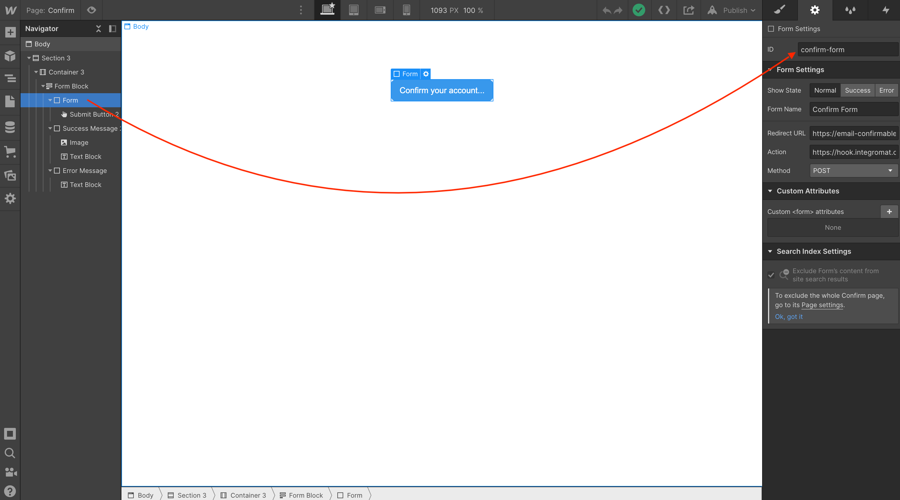
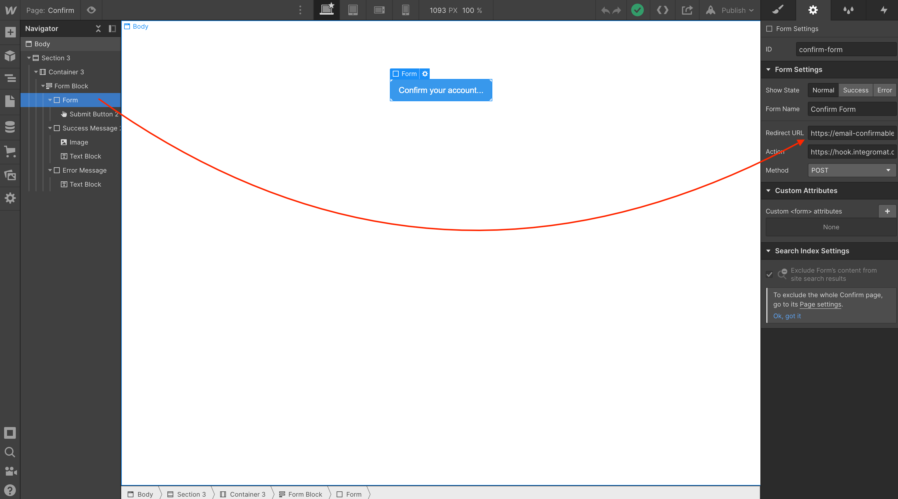
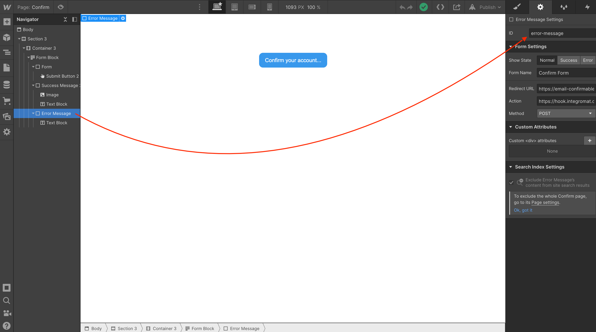
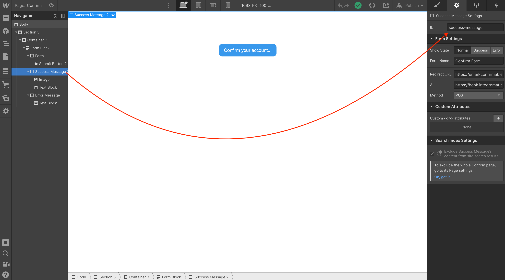

## Confirm page: Binding Webflow page elements to the custom Javascript code



Bound to <a href="https://github.com/NoCodeQuest/Email-Confirmations/blob/main/confirm_page.js#L8-L9">this snippet of code</a>:

```
// replace with your form ID
const form = document.getElementById('confirm-form');
```  



Bound to <a href="https://github.com/NoCodeQuest/Email-Confirmations/blob/main/confirm_page.js#L100">this snippet of code</a>:

```
window.location.assign(event.srcElement.dataset.redirect + data.slug);
```

You don't need to change anything in the code 👆just be aware that this is the line of code that binds to the above screenshot. You'll need to make sure you add a full and valid url to that field in the Webflow Designer.

For example:

```
https://email-confirmable.webflow.io/confirmed/
```

Which is the url to your CMS Collection Page. Also...notice the trailering `/` this is required as the redirect will fail without it.



Bound to <a href="https://github.com/NoCodeQuest/Email-Confirmations/blob/main/confirm_page.js#L16-L17">this snippet of code</a>:

```
// set the Webflow Error Message Div Block ID to 'error-message'
let failureMessage = document.getElementById('error-message');
```  



Bound to <a href="https://github.com/NoCodeQuest/Email-Confirmations/blob/main/confirm_page.js#L19-L20">this snippet of code</a>:

```
// set the Webflow Success Message Div Block ID to 'success-message'
let successMessage = document.getElementById('success-message');
```  
