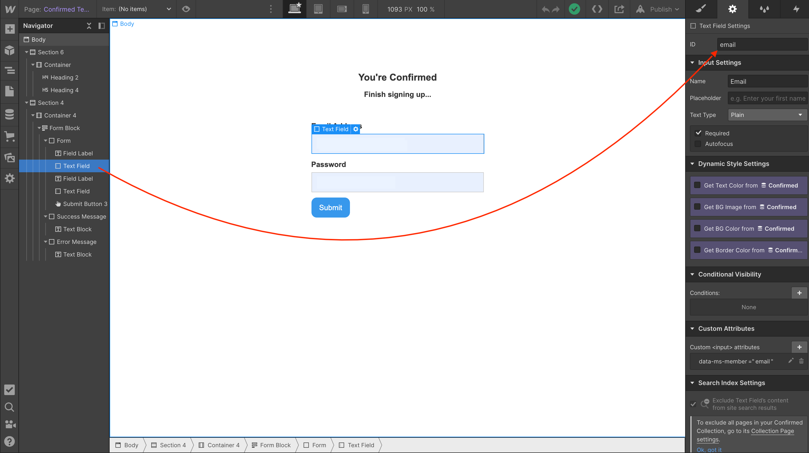

## Confirmed page: Binding Webflow page elements to the custom Javascript code



Bound to <a href="https://github.com/NoCodeQuest/Email-Confirmations/blob/main/confirmed_page.js#L5">this snippet of code</a>:

```
let emailField = document.getElementById('email');
```  


Bound to <a href="https://github.com/NoCodeQuest/Email-Confirmations/blob/main/confirmed_page.js#L6">this snippet of code</a>, replacing \_EMAIL\_ with the CMS field from the dropdown shown:

```
emailField.value="_EMAIL_";
```
