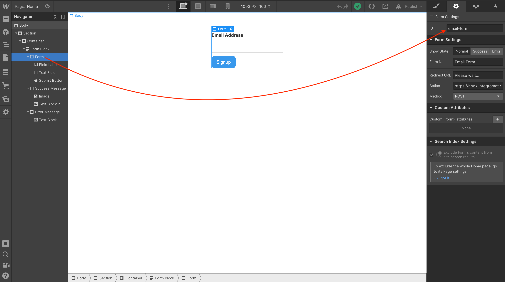
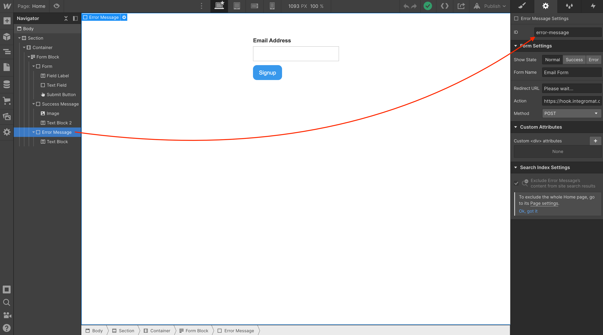
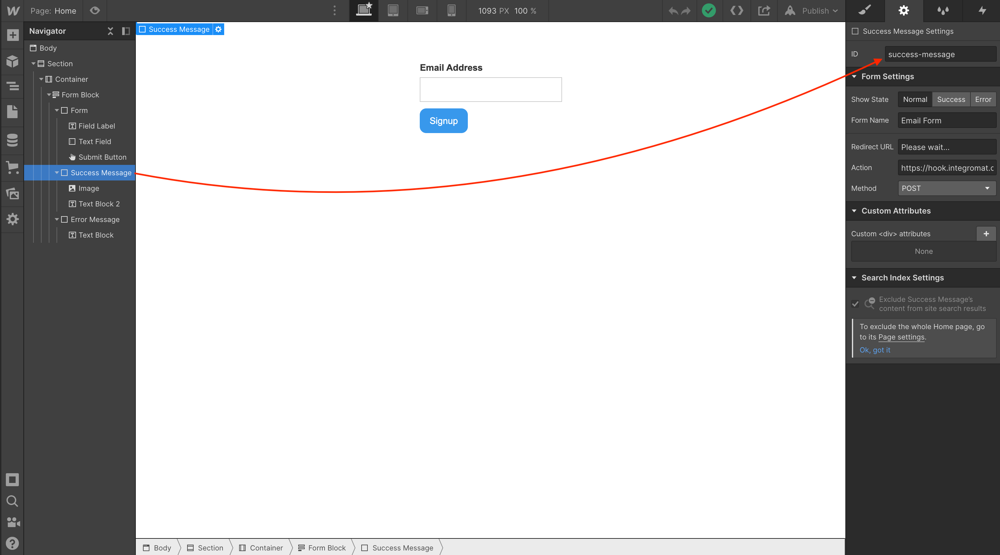

## Home page: Binding Webflow page elements to the custom Javascript code



Bound to <a href="https://github.com/NoCodeQuest/Email-Confirmations/blob/main/home_page.js#L9">this snippet of code</a>:

```
// replace with your form ID
const form = document.getElementById('email-form');
```  



Bound to <a href="https://github.com/NoCodeQuest/Email-Confirmations/blob/main/home_page.js#L12">this snippet of code</a>:

```
// replace with your Webflow Error Message Div Block ID here.
let failureMessage = document.getElementById('error-message');
```



Bound to <a href="https://github.com/NoCodeQuest/Email-Confirmations/blob/main/home_page.js#L15">this snippet of code</a>:

```
// replace with your Webflow Success Message Div Block ID here.
let successMessage = document.getElementById('success-message');
```
